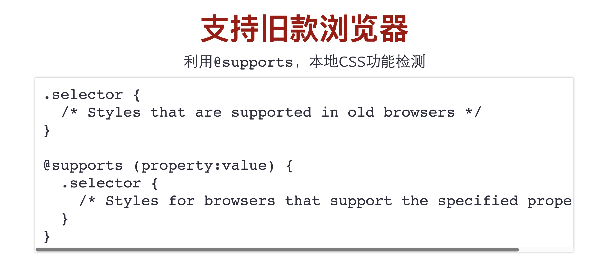

## 第五届css开发者大会分享
 
 - maybe 最后一届
 - 使用的工具[https://codemirror.net/](https://codemirror.net/)
 - 在线编辑工具还有codepen

## 一、新时代css布局    
 - 演讲视频：https://www.chenhuijing.com/slides/53-cssconfcn-2019/#/
 - [分享链接](https://www.yuque.com/cssconf/5th/hmzpxe)        
 - 陈慧晶、马来西亚人,华裔，知名CSS专家、Nexmo开发大使
 - [最开始的网页](https://worldwideweb.cern.ch/browser/)
 - css新的布局战队：box alignment、flexbox、grid
 - display的取值分类
 - 
 - 
 - 介绍flex的取值分类
 - 
 ```
 // html 
 <div class="container">
  container
  <div class="item1">item1</div>
  <div class="item2">item2</div>
 </div>
 // css
 .container {
   display: flex;
   border: 1px solid red;
 }
 .container .item1 {
   flex: none;
   border: 1px solid blue;
  }
 .container .item2 {
   width: 100px;
 }
 ```
 - 巧用margin: auto;
 - 例子： [https://www.chenhuijing.com/slides/53-cssconfcn-2019/#/17](https://www.chenhuijing.com/slides/53-cssconfcn-2019/#/17)
 - 垂直居中有很多种方式，其中margin：auto
 - 为什么块格式自动margin:auto不能水平垂直居中？
 - 
 - [https://www.w3.org/TR/CSS22/visudet.html#blockwidth](https://www.w3.org/TR/CSS22/visudet.html#blockwidth)
 - 演示地址：

 ```

    // html
    <div class="container">
    <div class="container--inner">
    </div>
    
    // css
    .container {
    width: 200px;
    height: 200px;
    border: 1px solid red;
    /* display: flex; */
    }

    .container .container--inner {
    margin: auto;
    width: 100px;
    height: 100px;
    border: 1px solid blue;
    }

 ```
 - grid 布局
 - 操作示例[https://www.chenhuijing.com/slides/53-cssconfcn-2019/#/21](https://www.chenhuijing.com/slides/53-cssconfcn-2019/#/21)
 ```
 grid-template-rows 网格行的布局

 .body {
    grid-template-rows: 50px 100px 90px 120px
 }

 grid-template-columns 网格列的布局

 .body {
    grid-template-columns: 50px 100px 90px 120px
 }

 grid-template-areas 是grid areas 在CSS中的特定命名

 // 定义一种
 grid-template-areas: 
    "a b b"
    "a b b"
    "c c d";
  // 
  .gridcontent .box.a { grid-area: a }
  .gridcontent .box.b { grid-area: b }
  .gridcontent .box.c { grid-area: c }
  .gridcontent .box.d { grid-area: d } 
 grid-gap 间距的统称
 grid-column-gap： 行的间距
 grid-row-gap： 列的间距

 隐式网格属性 ：grid-auto-rows、grid-auto-columns 和  grid-auto-flow，
 grid-template-columns 网格列的布局
 
 ```
 - 举个例子：test.htnml和test1.html
 - 具体可参考大漠写的文章：[https://www.w3cplus.com/css/learncssgrid.html](https://www.w3cplus.com/css/learncssgrid.html)
 - grid和flex?
 - 
 - 
 - 支持旧版浏览器
 - 

## 二、剖析css-tricks新版，为你所用      
 - 大漠，知名CSS专家、阿里巴巴前端技术专家
 - [https://css-tricks.com/](https://css-tricks.com/)
 - 演讲ppt[https://www.yuque.com/office/yuque/0/2019/pdf/168578/1554174111678-40a3ee34-5e94-48aa-b0fe-48b1afbc2899.pdf](https://www.yuque.com/office/yuque/0/2019/pdf/168578/1554174111678-40a3ee34-5e94-48aa-b0fe-48b1afbc2899.pdf)
 - SVG
 - 滚动特性

 ```
    -webkit-scrollbar
    -webkit-scrollbar-button
    -webkit-scrollbar-thumb
    -webkit-scrollbar-track
    -webkit-scrollbar-track-piece
    -webkit-scrollbar-corner
    -webkit-scrollbar-resizer
 ```
 - 例子->scroll.html
 - 详情可见[https://developer.mozilla.org/zh-CN/docs/Web/CSS/::-webkit-scrollbar](https://developer.mozilla.org/zh-CN/docs/Web/CSS/::-webkit-scrollbar)
 - 滚动捕捉
 - 例子：[https://codepen.io/airen/full/VRgevr](https://codepen.io/airen/full/VRgevr)

 ```
 .monthly-mixup {
    overflow-x: auto;
    overflow-scrolling: touch;
    scroll-snap-points-x: repeat(250px);
    scroll-snap-type: mandatory;
 }
 ```
 - 自定义属性
 - Web Layout
 - 混合模式和滤镜
 - 其他
 

## 三、CSS创意与视觉表现
 - 张鑫旭，《CSS世界》作者、阅文集团前端开发
 - 演讲的地址：[https://www.yuque.com/office/yuque/0/2019/pdf/168578/1554174734641-ebc178ce-df8a-4bd7-ac4c-ad75c8b339f0.pdf](https://www.yuque.com/office/yuque/0/2019/pdf/168578/1554174734641-ebc178ce-df8a-4bd7-ac4c-ad75c8b339f0.pdf)

## 四、CSS生成艺术
 - 袁川，css-doodle 作者。 [他的创意](https://codepen.io/yuanchuan/)
 - 演讲链接[https://yuanchuan.name/talk/generative-art-with-css/](https://yuanchuan.name/talk/generative-art-with-css/)

## 五、你不知道的五个css的新特性 --- 5 css features
 - 勾三股四，阿里巴巴高级前端技术专家,vue成员之一
 - [示例](https://www.npmjs.com/package/vue-mark-display)
 - [github](https://github.com/jinjiang/vue-mark-display)
 - [分享原文](https://www.yuque.com/cssconf/5th/nbcc82)
 - [分享链接](https://www.yuque.com/office/yuque/0/2019/pdf/168578/1554169837487-d64f836b-fb98-4de6-a25b-794c7c48fd11.pdf)

## 六、10 things I wish CSS authors knew about animations
 - Brian Birtles 火狐浏览器工程师、专注于动画领域，W3C CSS工作组成员
 - [css动画，你应该知道的10个事件](https://www.yuque.com/cssconf/5th/nays55)

## 七、CSS TIME 
 - 陈在真 腾讯CDC高级前端开发
 - [css time](https://www.yuque.com/office/yuque/0/2019/pdf/168578/1554175613589-1cafa4f1-bfa6-4c48-a2e0-f58d56b549bf.pdf)


## 参考链接

  - 演讲ppt使用的工具地址：https://codemirror.net/
  - grid 布局的由来：https://www.smashingmagazine.com/2018/03/understanding-logical-properties-values/
  - css 大会的所有PPT https://css.w3ctech.com/
  - vue-mark-display npm链接：https://www.npmjs.com/package/vue-mark-display,

  - vue-mark-display 地址： https://github.com/jinjiang/vue-mark-display